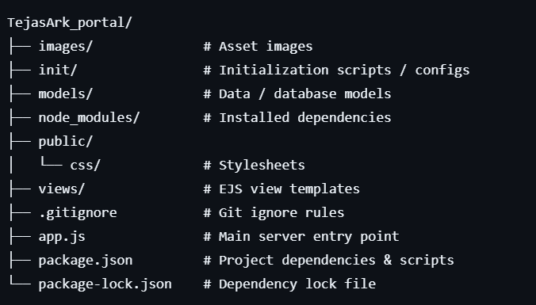
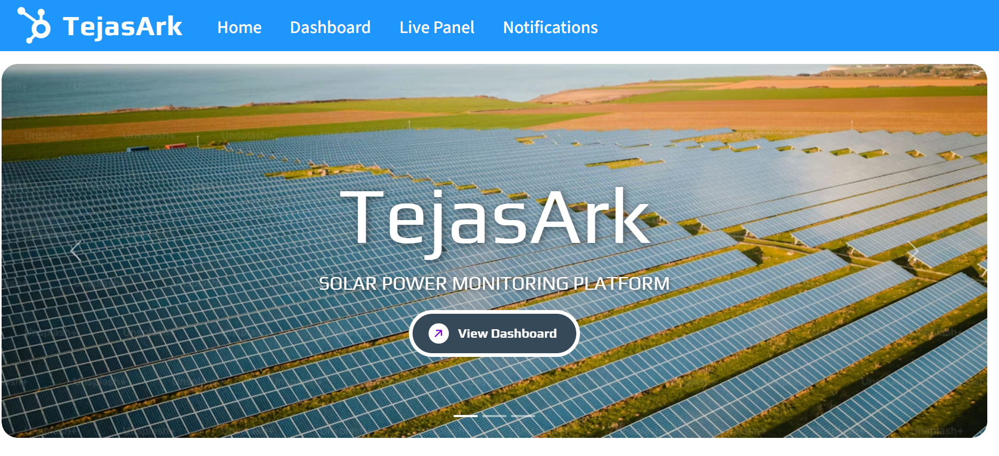
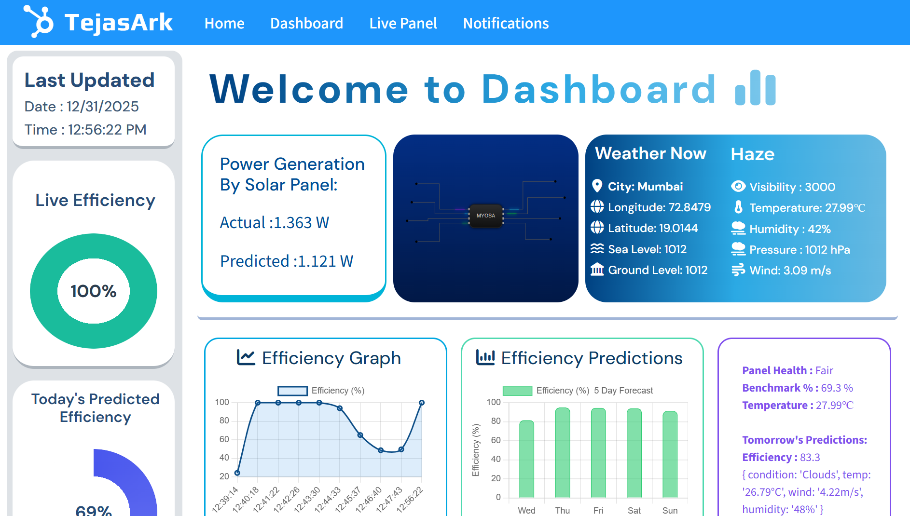
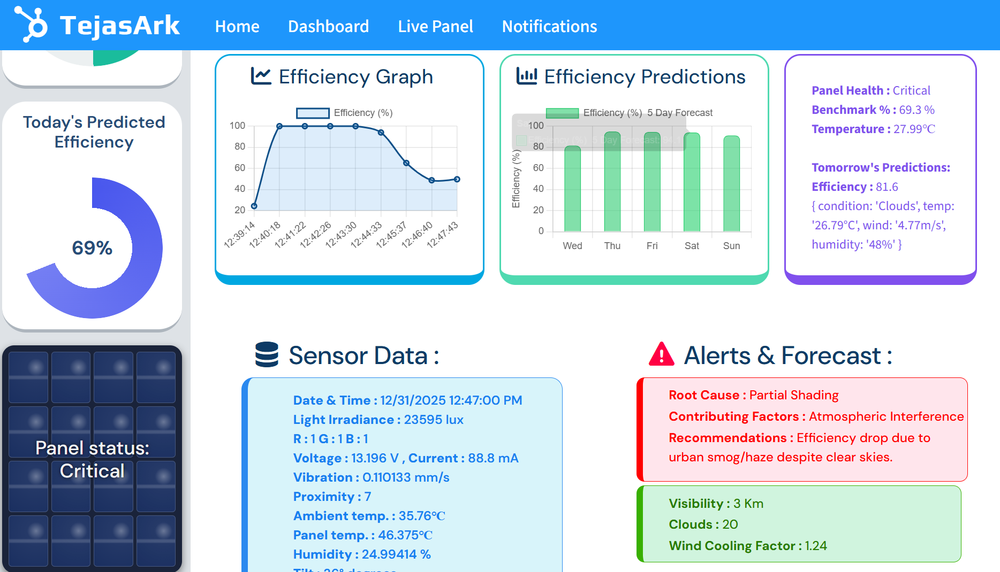
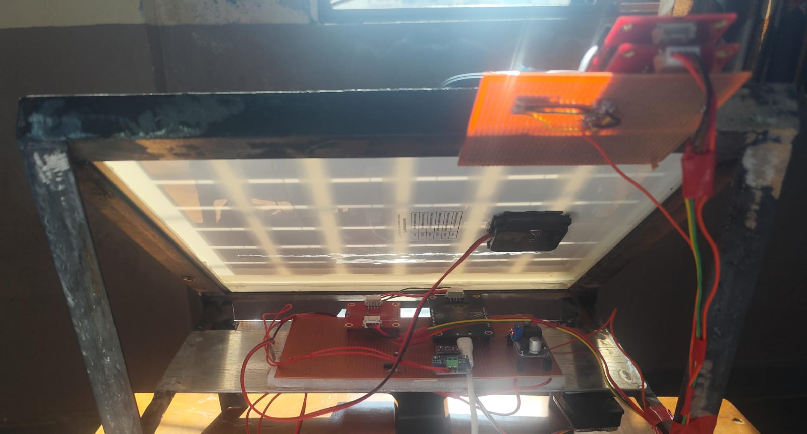
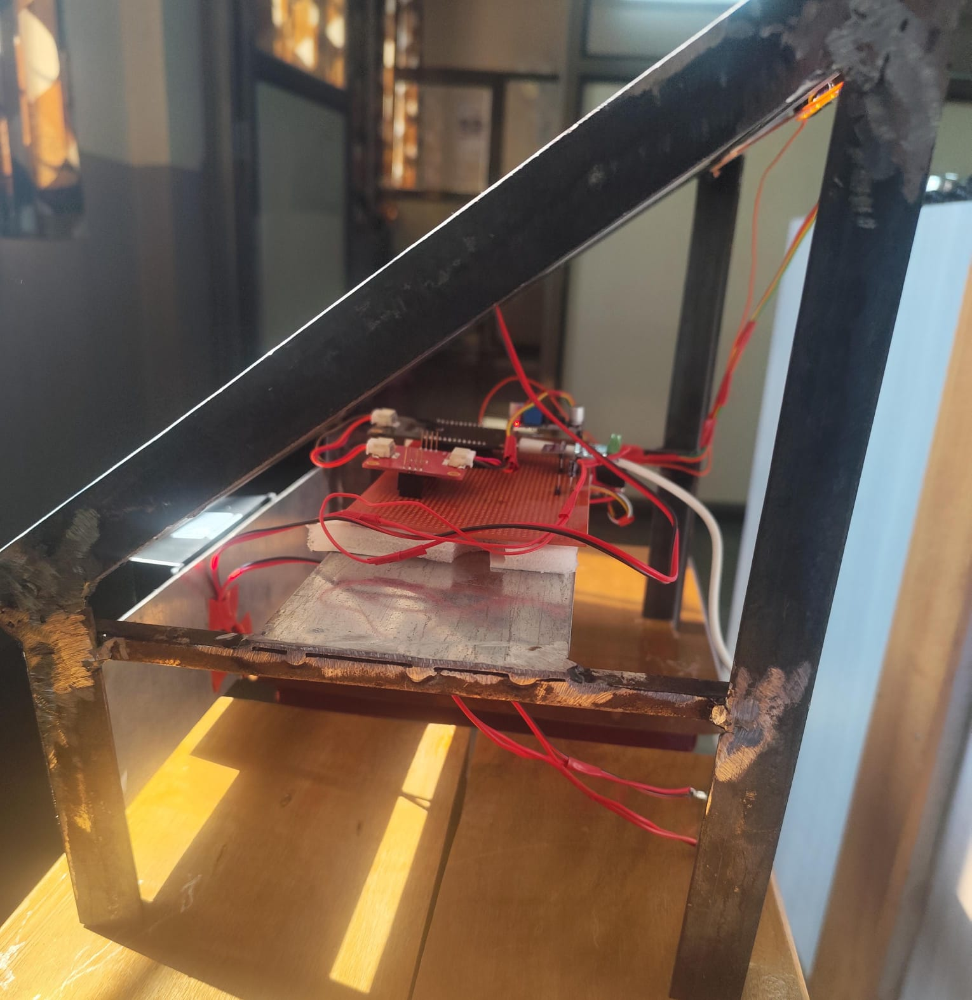

## TejasArk 

*Published Date* : 31 Dec 2025

*Title: Tejasark - Sonsor Based AI Powered Solar Panel Monitoring System*

# TejasArk Portal

**TejasArk Portal** is a web application developed as an **IEEE Myosa Sensors Competition**. It serves as the main portal for the TejasArk team, providing dynamic views, user interaction, and content delivery using Node.js, Express, and EJS templating.

Excerpt:
Undetected faults and environmental effects significantly reduce solar efficiency. TejasArk delivers Sensor based AI supported solution for real-time PV monitoring, fualt detection, and predictive maintenance.



## tags:
  - solar-energy
  - iot-monitoring
  - photovoltaic
  - sensor-data
  - predictive-maintenance

*Improving solar panel reliability through continuous sensor-based monitoring and smart diagnostics.*

## Acknowledgements

We, Team TejasArk would like to express our sincere gratitude to the **IEEE Sensors Council** and the **MYOSA 4.0** team for providing the platform and resources to develop this project. The MYOSA Mini Kit and open-source environment were instrumental in the prototyping of TejasArk. 

We are also thankful to our mentor, [Ms. Valentina Basker](https://ieeexplore.ieee.org/author/37088858636) as well as our college [St. Francis Institute Of Technology](https://www.sfit.ac.in/) for their invaluable guidance and support.

## Overview

Solar PV systems often suffer from unnoticed performance degradation caused by dust buildup, environmental stress, and hidden technical faults, leading to reduced energy output and higher maintenance costs. This project addresses the problem through a sensor-driven IoT framework that continuously monitors temperature, voltage, current, irradiance, and environmental parameters to detect faults and efficiency loss in real time. AI-based analytics are applied as a secondary layer to predict performance decline and recommend timely maintenance, resulting in a low-cost, self-diagnostic solution that improves reliability and minimizes downtime.

## Demo / Examples
### Images
<p align="center">
<br/>
<i>TejasArk Main Page</i>
</p>

<p align="center">
<br/>
<br/>
<i>TejasArk Dashboard</i>
</p>

<p align="center">
  
  <br/>
  <i>TejasArk Hardware</i>
</p>

## 📌 Features

- 🔹 Dynamic content rendering using **EJS templates**
- 🔹 Structured routing via **Express.js**
- 🔹 Static assets served from `public/` (CSS, images)
- 🔹 MVC-like organization (`models`, `views`, etc.)
- 🔹 Easy setup for development and deployment

## Usage Instructions

1. Connect the voltage, current, temperature, irradiance, and environmental sensors to the MYOSA board / ESP module and mount them on the solar panel setup.

2. Power on the system to initiate real-time data acquisition. Sensor readings are continuously captured and transmitted to the backend server.

3. Access the web dashboard through a browser to view live sensor values, historical performance graphs, and system status indicators. View at http://localhost:8080/. 

4. Monitor alerts and visual indicators that highlight abnormal conditions such as dust accumulation, shading, overheating, or performance degradation.

5. Use the AI-assisted insights to review predicted efficiency loss and follow the recommended maintenance actions to improve system reliability.


## Tech Stack

<p align="center">
  
  
  
  
  
  
  
  
  
</p>

<p align="center">
  <strong>
    HTML • CSS • JavaScript • Node.js • Express.js • MongoDB • EJS • Python • C++
  </strong>
</p>

## 📌 Technologies

- # Frontend

HTML5 – Structure and semantic layout

CSS3 – Responsive UI, dashboard styling, animations

JavaScript (ES6) – Client-side logic, charts, and API handling

EJS (Embedded JavaScript) – Server-side templating for dynamic views

- # Backend

Node.js – Runtime environment for backend services

Express.js – RESTful API development and routing

- # Database

MongoDB Atlas – Cloud-based NoSQL database for storing sensor and AI data

Mongoose – ODM for schema modeling and database interaction

- # IoT & Data Source

MYOSA Motherboard – Real-time sensor data acquisition

Solar Panel Sensors – Voltage, current, power monitoring

- # APIs & Integrations

REST APIs – Data exchange between IoT devices and web dashboard

OpenWeather API – Weather-based contextual insights (optional module)

- # Visualization

Chart.js – Real-time data visualization (graphs & trends)

- # Development & Deployment

Git & GitHub – Version control and collaboration

VS Code – Development environment

Arduino IDE - Hardware side coding

Render – Deployment (as applicable)

- # AI / Analytics

Python – Data preprocessing and AI logic

Flask: micro-web framework

Tensorflow/Keras: Used to built and train deep nueral network model

Scikit learn: Data Processing Operations

Numpy & Pandas - For numerical calculations

Machine Learning Models – Solar performance insights and predictions

## Requirements / Installation
1. **Clone the repo**

   ```bash
   git clone https://github.com/parthteredesai/TejasArk_portal.git
2. **Navigate to project folder**
   cd TejasArk_portal
   

3.**Install dependencies**

<ul>
  
  *All required dependencies are in package.json.
  In your project terminal inside /TejasArk_portal perform **npm install**. It will automatically download all required   depencies in your system.*
  
  steps:
  <li>1️⃣ Prerequisites : You must have Node.js installed (which includes npm) </li>
  <li>2️⃣ Clone the repository :
    ```bash
    
    git clone https://github.com/parthteredesai/TejasArk_portal.git
    cd TejasArk_portal
  </li>
  <li>3️⃣ Install dependencies :
   ```bash
    
    npm install
  </li>
  <li>4️⃣ Start the application :
    ```bash

    npm start
   or
    ```bash

    node app.js 

   The application should now be running at http://localhost:8080/. 
  </li>
</ul>

## 📌 Important

- make your own .env file for weather.api & Mongodb URL
  
## Folder Architecture


🤝 Contributing
## Contributions are welcome! Please follow these steps:
- Fork the Project.
- Create your Feature Branch (git checkout -b feature/Feature).
- Commit your Changes (git commit -m 'Add some Feature').
- Push to the Branch (git push origin feature/AmazingFeature).
- Open a Pull Request.

📄 License
None

📧 Contact
Team TejasArk

Email: ds62442.phnx@student.sfit.ac.in,  parth.teredesai@student.sfit.ac.in,  arhaanshaikh020@student.sfit.ac.in
